# Academic Figure Skills

三套学术绘图 Codex skills：motivation / method 生成可编辑 **Excalidraw** 示意图；figure 使用科学绘图库生成数据图。均支持高清 **PNG、PDF、SVG**。

| Skill | 适用任务 | 布局偏好 |
|---|---|---|
| [motivation](skills/motivation/SKILL.md) | 动机、局限、设计理由与方法对比 | 紧凑对比，可纵向组织 |
| [method](skills/method/SKILL.md) | 方法架构、机制、数据流与训练流程 | 横向一体化、高信息密度，默认无明显步骤编号 |
| [figure](skills/figure/SKILL.md) | 学术实验数据图、参考风格复绘 | 多面板曲线、双轴、柱状图、雷达图与 3D 实验图；提供代码与数据 |

## 使用

```bash
git clone https://github.com/Dhs2004/draw-skills-motivation_method.git
```

在 Codex 中提供参考图或方法描述，并指定 skill 的实际路径：

> 使用 /path/to/draw-skills-motivation_method/skills/method/SKILL.md，根据这张参考图生成横向、一体化、信息密度高的学术方法图，保存到指定目录，导出 Excalidraw、PNG 和 PDF。

绘制 motivation 图时改用 `skills/motivation/SKILL.md`。修改现有图时提供当前 `.excalidraw`，以保留手动调整。

## Motivation / Method 视觉与内容规则

- 模块背景优先使用原生手绘斜线填充，浅色区分语义区域；保留黑灰框线、清楚的卡通字体和原色实体图标。
- 以 GRPO / Transformer 的信息密度为基准；通过分层调整字号、精简长句和收紧间距减少留白，避免堆叠数值表与重复说明。
- 根据实际问题调整布局或字号来减少空白，也可两者结合：重分配列宽与模块高度、收紧间距和画布，或适当放大文字；保持可读性与必要分组留白。
- 按实际语义寻找新图标，不局限于现有素材；矩阵、token、曲线和流程仍用原生工具。
- 公式逐条调整，只缩小明显偏大的具体公式；正常公式保持原尺寸，分式与上下标须可读。
- 保留科学含义；示意数据不是实验结果，不为填空白编造算法。
- 导出后查看整图与密集局部，检查字体、图文/连线遮挡和文件一致性。

## Motivation 示例

<table>
  <tr>
    <th width="50%">GRPO</th>
    <th width="50%">Transformer</th>
  </tr>
  <tr>
    <td align="center"><a href="skills/motivation/assets/grpo/motivation.png">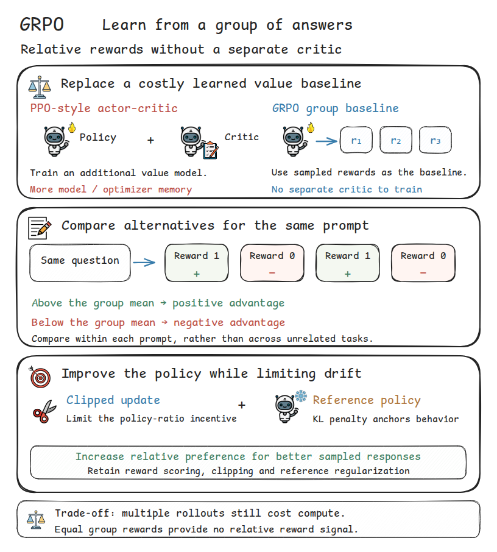</a></td>
    <td align="center"><a href="skills/motivation/assets/transformer/motivation.png">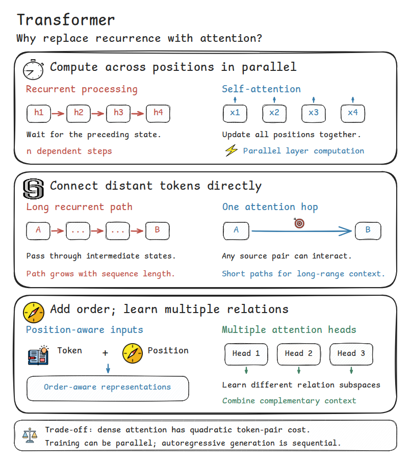</a></td>
  </tr>
  <tr>
    <td align="center"><a href="skills/motivation/assets/grpo/motivation.excalidraw">可编辑源文件</a> · <a href="skills/motivation/assets/grpo/motivation.pdf">PDF</a></td>
    <td align="center"><a href="skills/motivation/assets/transformer/motivation.excalidraw">可编辑源文件</a> · <a href="skills/motivation/assets/transformer/motivation.pdf">PDF</a></td>
  </tr>
  <tr>
    <th>DAPO</th>
    <th>GiGPO</th>
  </tr>
  <tr>
    <td align="center"><a href="skills/motivation/assets/dapo/motivation.png">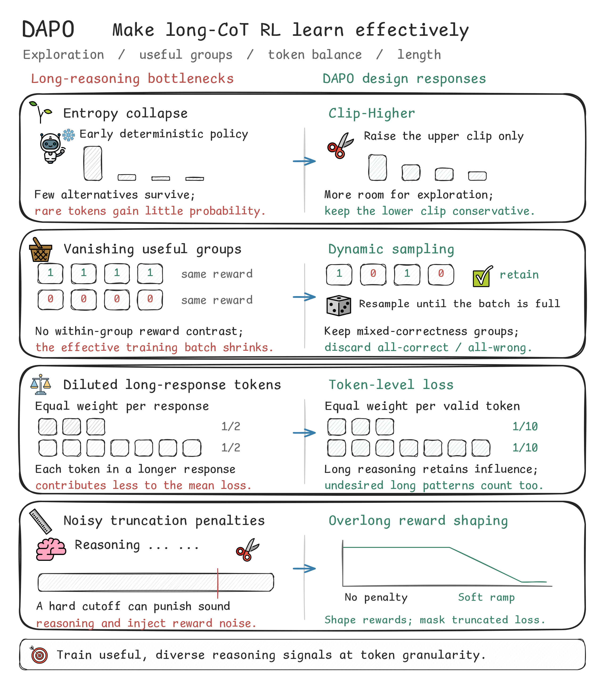</a></td>
    <td align="center"><a href="skills/motivation/assets/gigpo/motivation.png">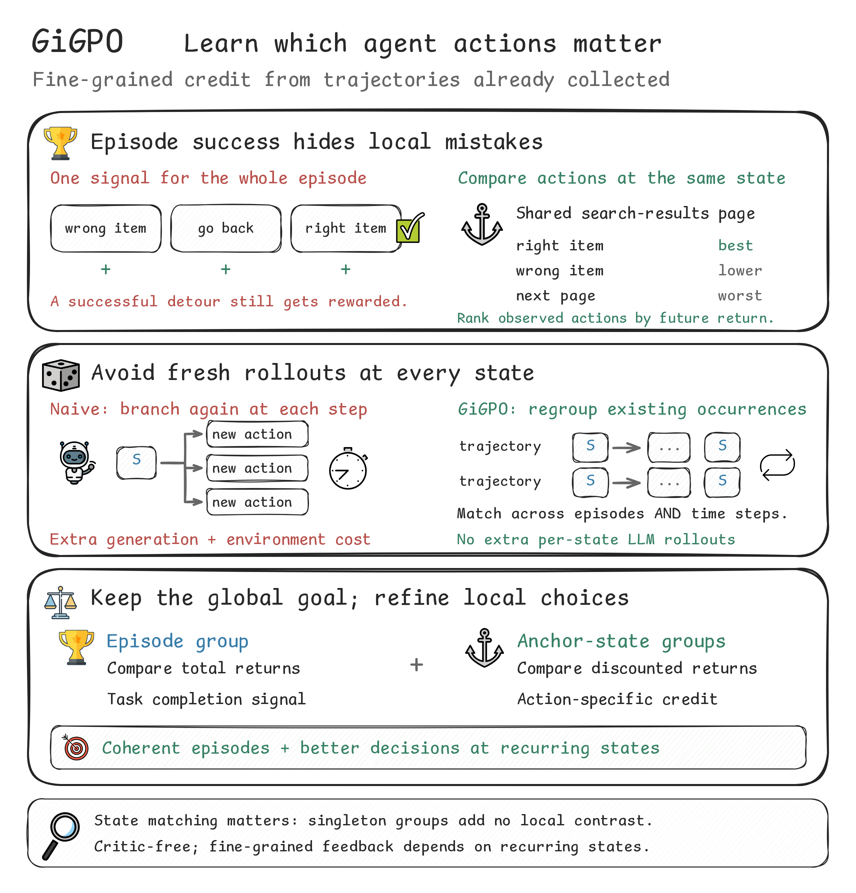</a></td>
  </tr>
  <tr>
    <td align="center"><a href="skills/motivation/assets/dapo/motivation.excalidraw">可编辑源文件</a> · <a href="skills/motivation/assets/dapo/motivation.pdf">PDF</a></td>
    <td align="center"><a href="skills/motivation/assets/gigpo/motivation.excalidraw">可编辑源文件</a> · <a href="skills/motivation/assets/gigpo/motivation.pdf">PDF</a></td>
  </tr>
  <tr><th>PPO</th><th>DEPPO</th></tr>
  <tr>
    <td align="center"><a href="skills/motivation/assets/ppo/motivation.png">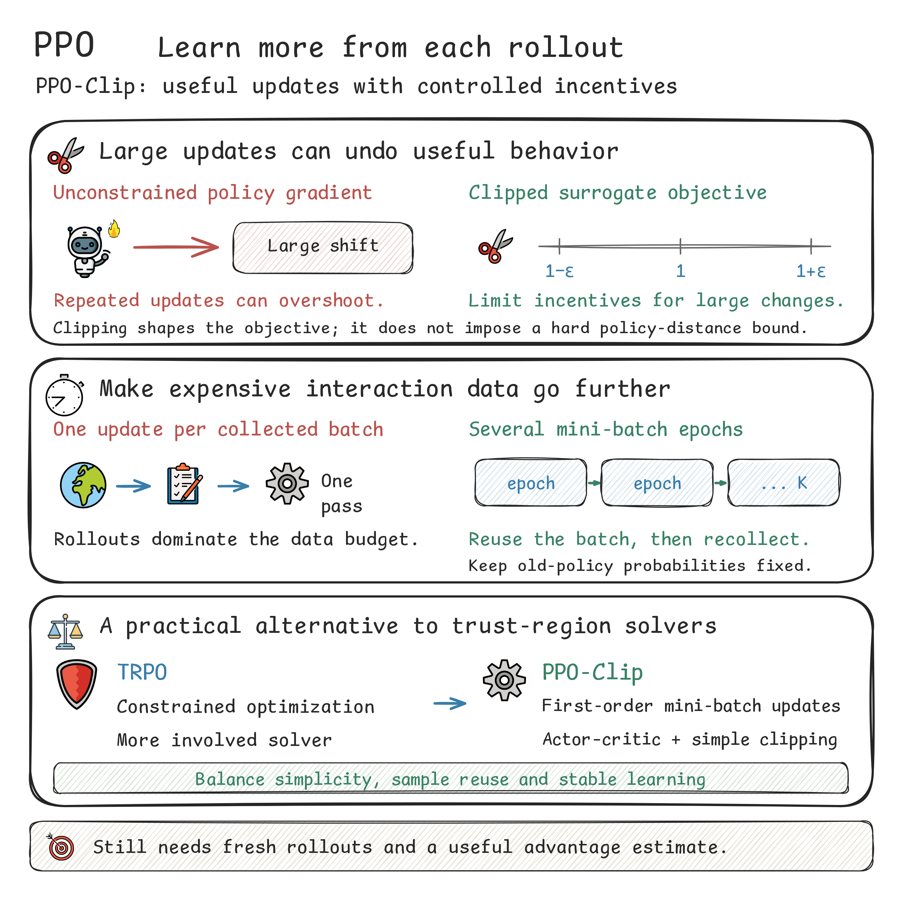</a></td>
    <td align="center"><a href="skills/motivation/assets/deppo/motivation.png">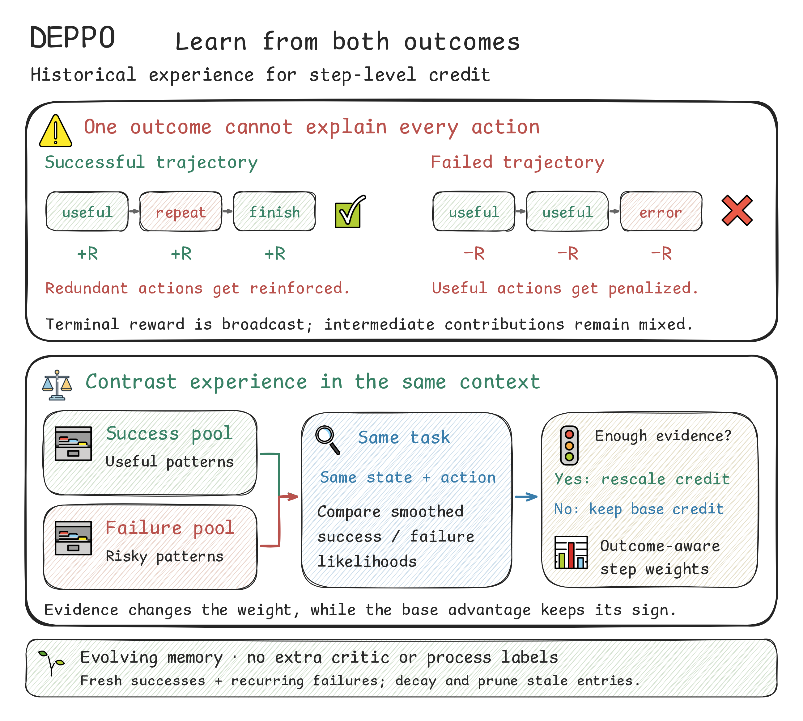</a></td>
  </tr>
  <tr>
    <td align="center"><a href="skills/motivation/assets/ppo/motivation.excalidraw">可编辑源文件</a> · <a href="skills/motivation/assets/ppo/motivation.pdf">PDF</a></td><td align="center"><a href="skills/motivation/assets/deppo/motivation.excalidraw">可编辑源文件</a> · <a href="skills/motivation/assets/deppo/motivation.pdf">PDF</a></td>
  </tr>
</table>

## Method 示例

### GRPO

基于 [DeepSeekMath (2024)](https://arxiv.org/abs/2402.03300) 的结果奖励版 GRPO。

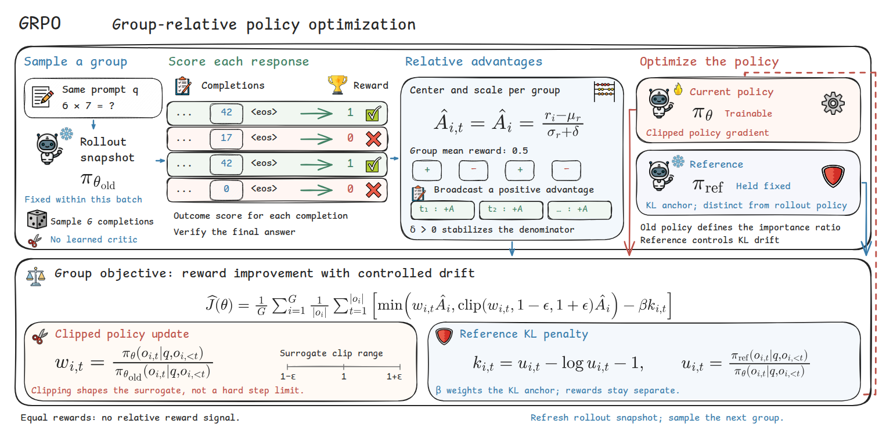

[可编辑源文件](skills/method/assets/grpo/method.excalidraw) · [PDF](skills/method/assets/grpo/method.pdf)

### Transformer

基于 [Attention Is All You Need (2017)](https://arxiv.org/abs/1706.03762) 的原始 encoder–decoder Transformer。

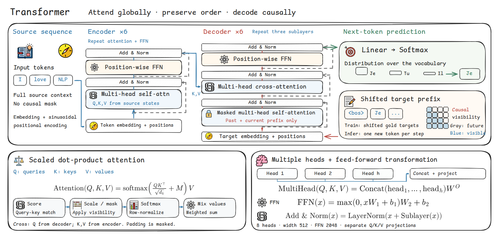

[可编辑源文件](skills/method/assets/transformer/method.excalidraw) · [PDF](skills/method/assets/transformer/method.pdf)

### DAPO

基于 [DAPO (2025)](https://arxiv.org/abs/2503.14476) 的横向一体化流程，包含动态筛选、组内优势、非对称裁剪、token 级损失和超长奖励塑形。

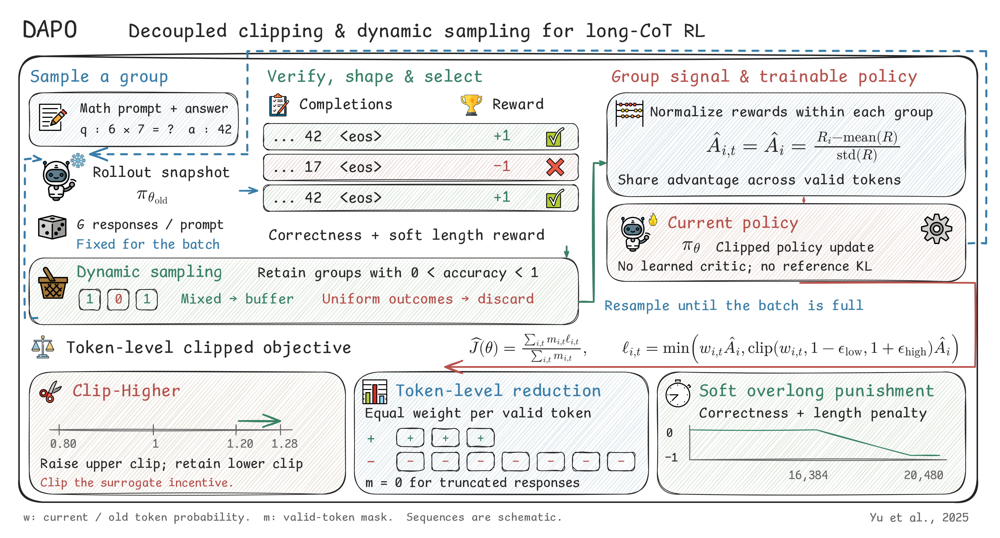

[可编辑源文件](skills/method/assets/dapo/method.excalidraw) · [PDF](skills/method/assets/dapo/method.pdf) · [公式源码](skills/method/assets/dapo/formulas) · [示例说明](skills/method/assets/dapo/README.md)

### GiGPO

基于 [Group-in-Group Policy Optimization (2025)](https://arxiv.org/abs/2505.10978)，展开多步环境交互、重复状态分组、两层优势与策略更新；以紧凑流程展示折扣回报与动作信用分配。

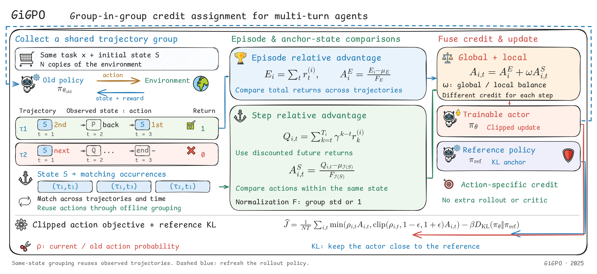

[可编辑源文件](skills/method/assets/gigpo/method.excalidraw) · [PDF](skills/method/assets/gigpo/method.pdf) · [公式源码](skills/method/assets/gigpo/formulas) · [示例说明](skills/method/assets/gigpo/README.md)

### PPO

基于 [Proximal Policy Optimization Algorithms (2017)](https://arxiv.org/abs/1707.06347) 的 PPO-Clip，展示 rollout、GAE、概率比率、多轮 mini-batch 更新，以及正负优势下的裁剪形状。

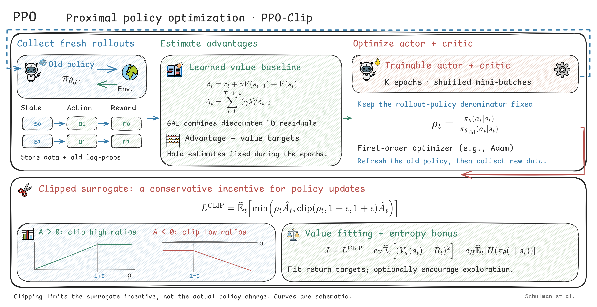

[可编辑源文件](skills/method/assets/ppo/method.excalidraw) · [PDF](skills/method/assets/ppo/method.pdf) · [公式源码](skills/method/assets/ppo/formulas) · [示例说明](skills/method/assets/ppo/README.md)

### DEPPO

基于已接收论文 **Dual Experience Pool Policy Optimization for Long-Horizon Reinforcement Learning**，展示历史成功／失败统计、支持度门控、结果感知优势重加权，以及不对称经验更新与衰减剪枝。使用更丰富的彩色语义图标区分成功／失败、优势调节和记忆维护。

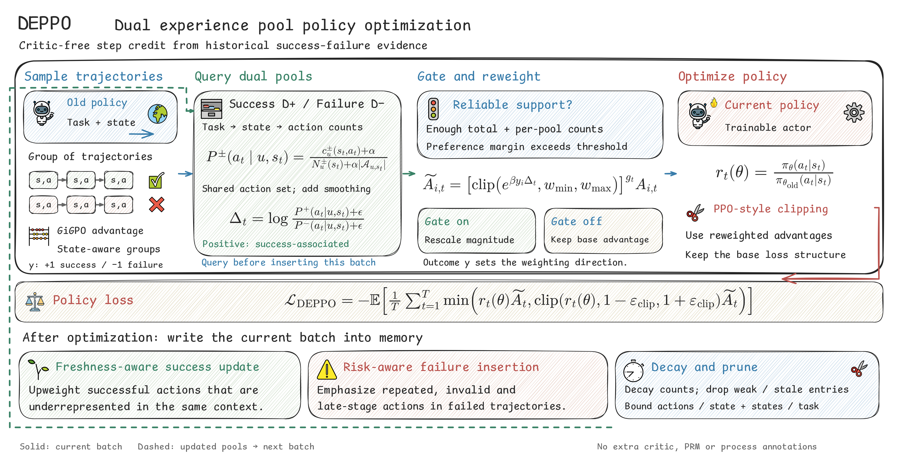

[可编辑源文件](skills/method/assets/deppo/method.excalidraw) · [PDF](skills/method/assets/deppo/method.pdf) · [公式源码](skills/method/assets/deppo/formulas) · [示例说明](skills/method/assets/deppo/README.md)

示例根据对应论文重新绘制，用于说明绘图风格。简化范围和素材来源见 [示例说明](skills/method/references/public-examples.md)。

## Figure 数据图示例

以下图表风格均使用 retry 生成的**模拟数据示例**。前三种的随机种子为 `20260929`，雷达图与三维图使用 `20260930` 生成的数据，多指标纹理柱状图使用 `20261001`。展示视觉风格，不代表真实实验结果。figure skill 使用标准科学绘图库，不沿用概念示意图的卡通字体或实体图标规则。

### 青橙三联训练与效率曲线

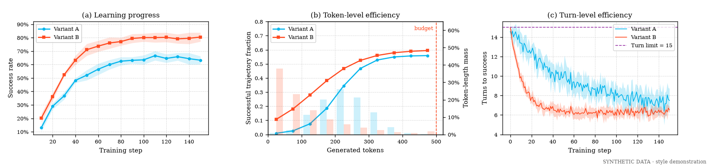

[高清 PNG](skills/figure/assets/examples/triptych_cyan_orange_learning_efficiency_synthetic.png) · [PDF](skills/figure/assets/examples/triptych_cyan_orange_learning_efficiency_synthetic.pdf) · [SVG](skills/figure/assets/examples/triptych_cyan_orange_learning_efficiency_synthetic.svg)

### 衬线六宫格多指标与双轴

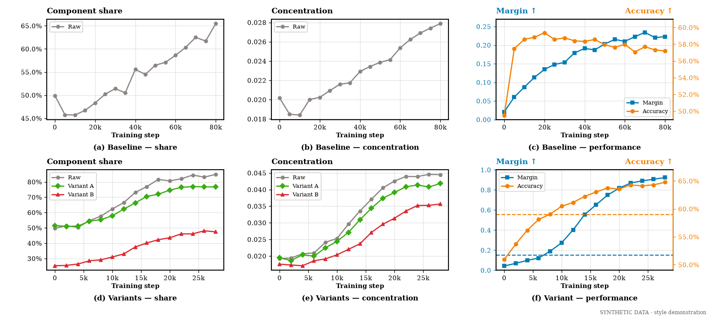

[高清 PNG](skills/figure/assets/examples/six_panel_serif_multimetric_dual_axis_synthetic.png) · [PDF](skills/figure/assets/examples/six_panel_serif_multimetric_dual_axis_synthetic.pdf) · [SVG](skills/figure/assets/examples/six_panel_serif_multimetric_dual_axis_synthetic.svg)

### 蓝色系分组柱状图与斜纹基线

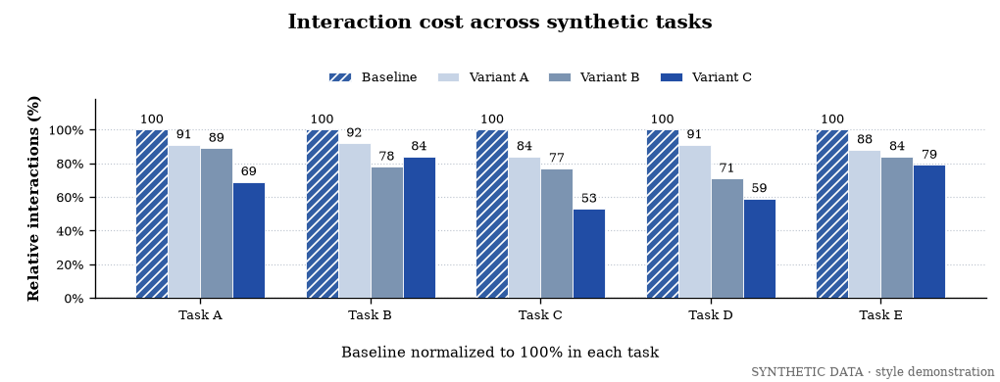

[高清 PNG](skills/figure/assets/examples/grouped_bar_blue_palette_hatched_baseline_synthetic.png) · [PDF](skills/figure/assets/examples/grouped_bar_blue_palette_hatched_baseline_synthetic.pdf) · [SVG](skills/figure/assets/examples/grouped_bar_blue_palette_hatched_baseline_synthetic.svg)

### 彩色外环雷达图

<table>
  <tr>
    <td align="center" width="33%"><b>柔彩花环</b><br><a href="skills/figure/assets/examples/annular_radar_pastel_bloom.png">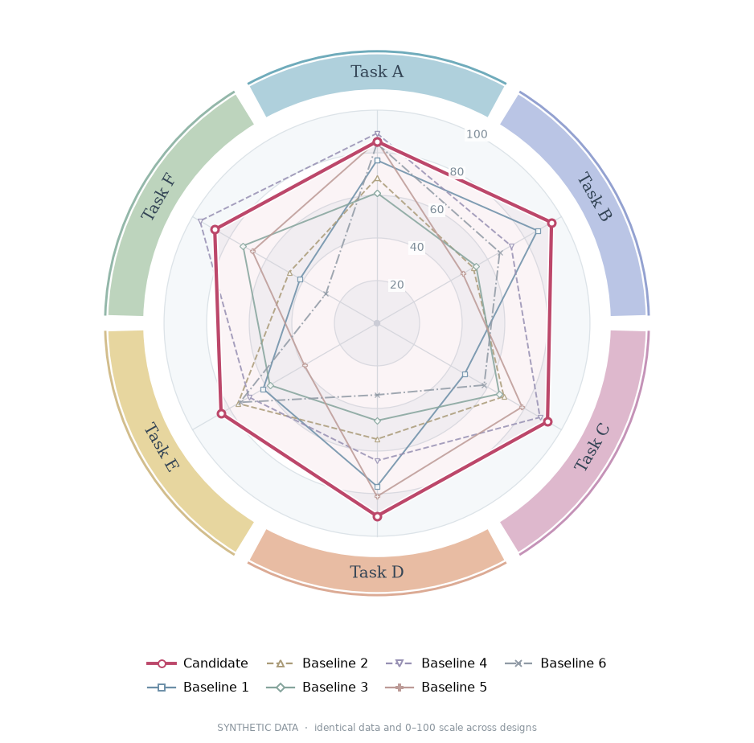</a><br><a href="skills/figure/assets/examples/annular_radar_pastel_bloom.png">PNG</a> · <a href="skills/figure/assets/examples/annular_radar_pastel_bloom.pdf">PDF</a> · <a href="skills/figure/assets/examples/annular_radar_pastel_bloom.svg">SVG</a></td>
    <td align="center" width="33%"><b>宝石色弧环</b><br><a href="skills/figure/assets/examples/annular_radar_jewel_arc.png">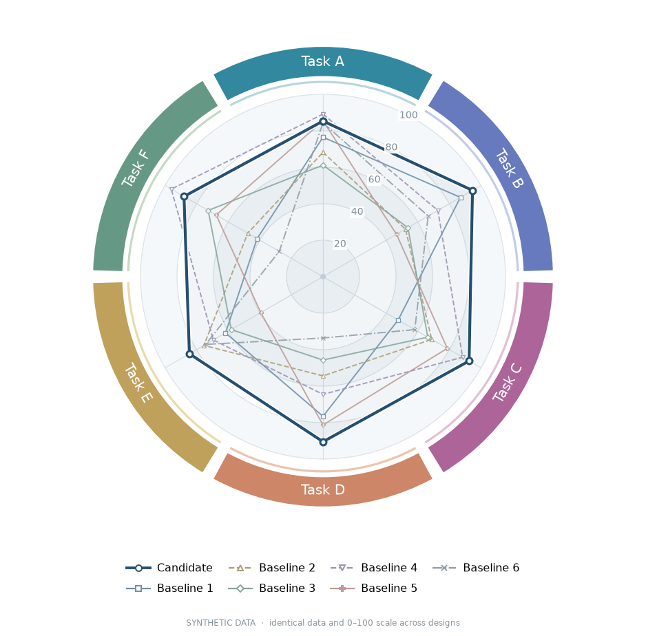</a><br><a href="skills/figure/assets/examples/annular_radar_jewel_arc.png">PNG</a> · <a href="skills/figure/assets/examples/annular_radar_jewel_arc.pdf">PDF</a> · <a href="skills/figure/assets/examples/annular_radar_jewel_arc.svg">SVG</a></td>
    <td align="center" width="33%"><b>青瓷双层环</b><br><a href="skills/figure/assets/examples/annular_radar_porcelain_double_ring.png">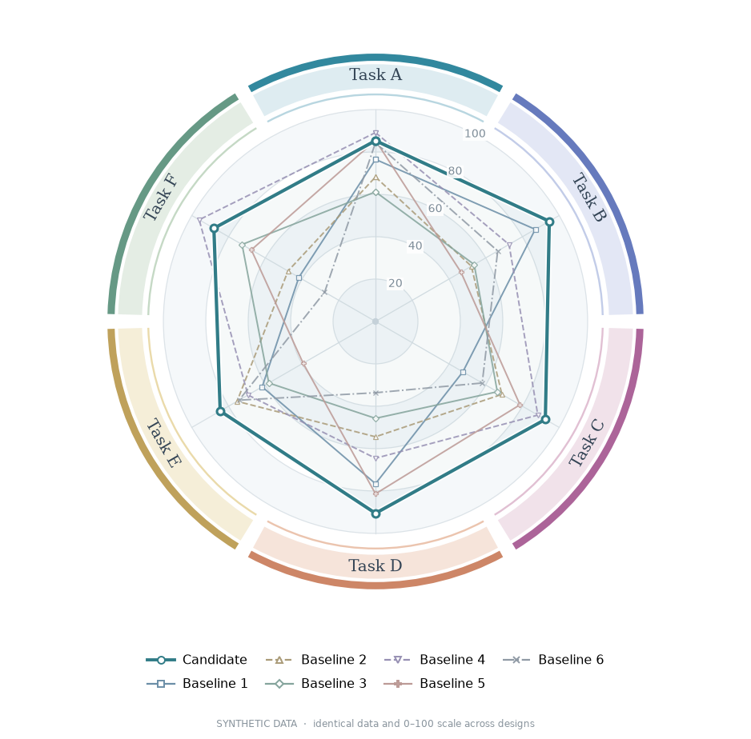</a><br><a href="skills/figure/assets/examples/annular_radar_porcelain_double_ring.png">PNG</a> · <a href="skills/figure/assets/examples/annular_radar_porcelain_double_ring.pdf">PDF</a> · <a href="skills/figure/assets/examples/annular_radar_porcelain_double_ring.svg">SVG</a></td>
  </tr>
  <tr>
    <td align="center" width="33%"><b>极光渐变环</b><br><a href="skills/figure/assets/examples/annular_radar_aurora_gradient.png">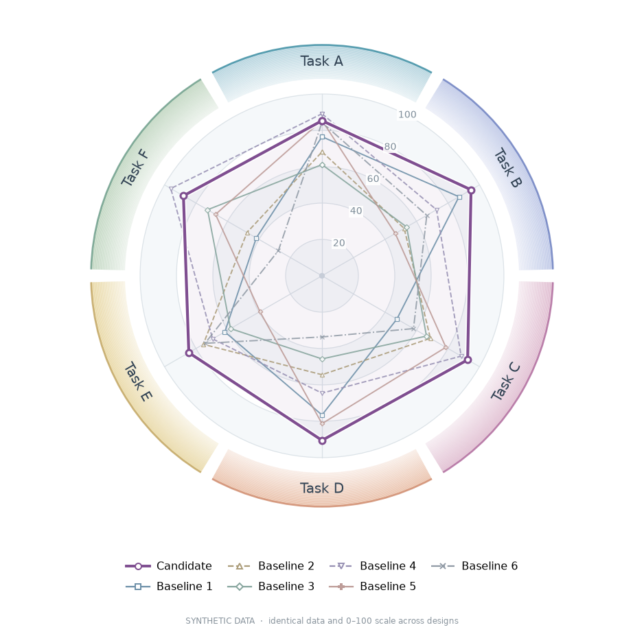</a><br><a href="skills/figure/assets/examples/annular_radar_aurora_gradient.png">PNG</a> · <a href="skills/figure/assets/examples/annular_radar_aurora_gradient.pdf">PDF</a> · <a href="skills/figure/assets/examples/annular_radar_aurora_gradient.svg">SVG</a></td>
    <td align="center" width="33%"><b>棱面彩环</b><br><a href="skills/figure/assets/examples/annular_radar_faceted_spectrum.png">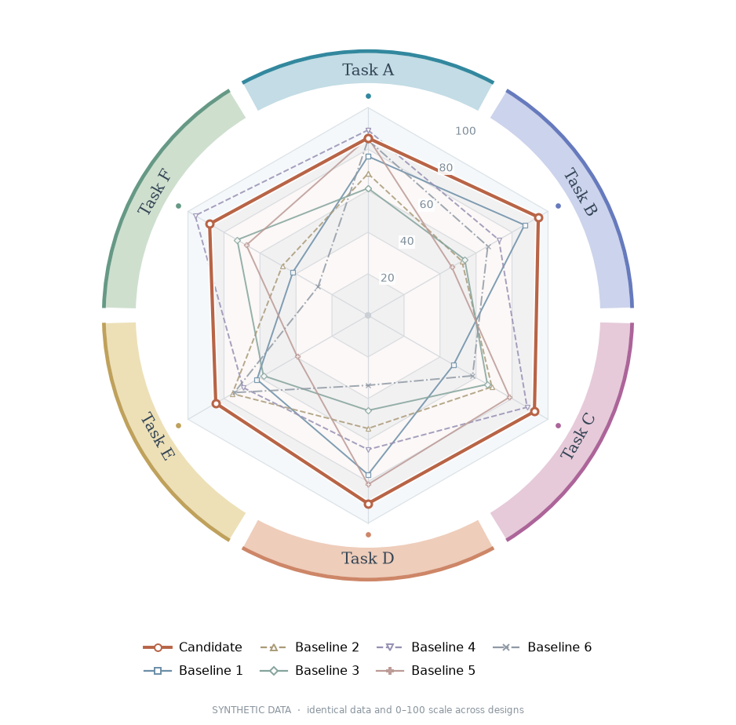</a><br><a href="skills/figure/assets/examples/annular_radar_faceted_spectrum.png">PNG</a> · <a href="skills/figure/assets/examples/annular_radar_faceted_spectrum.pdf">PDF</a> · <a href="skills/figure/assets/examples/annular_radar_faceted_spectrum.svg">SVG</a></td>
    <td align="center" width="33%"><b>极简彩带</b><br><a href="skills/figure/assets/examples/annular_radar_minimal_ribbon.png">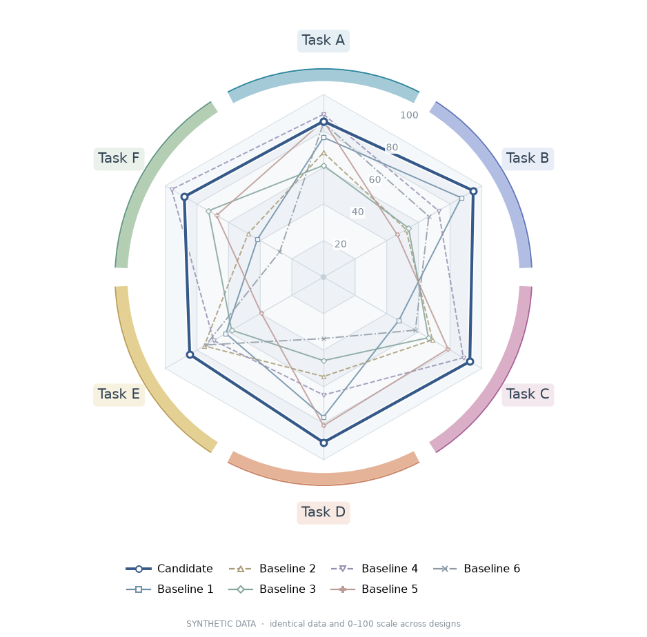</a><br><a href="skills/figure/assets/examples/annular_radar_minimal_ribbon.png">PNG</a> · <a href="skills/figure/assets/examples/annular_radar_minimal_ribbon.pdf">PDF</a> · <a href="skills/figure/assets/examples/annular_radar_minimal_ribbon.svg">SVG</a></td>
  </tr>
</table>

### 灰度纹理双面板柱状图

支持多指标与多任务；组内柱子相接，“全连续纹理柱群”连组间也无空隙。

<table>
  <tr>
    <td align="center" width="33%"><b>多任务分组对比</b><br><a href="skills/figure/assets/examples/hatched_bar_grouped_tasks.png">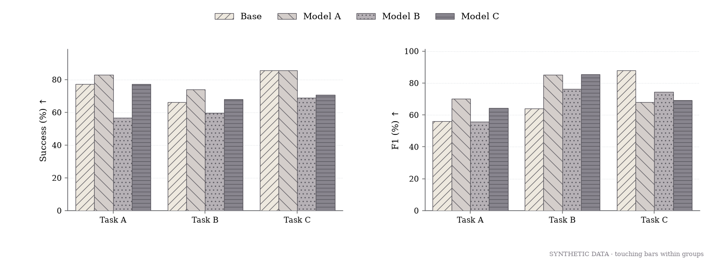</a><br><a href="skills/figure/assets/examples/hatched_bar_grouped_tasks.png">PNG</a> · <a href="skills/figure/assets/examples/hatched_bar_grouped_tasks.pdf">PDF</a> · <a href="skills/figure/assets/examples/hatched_bar_grouped_tasks.svg">SVG</a></td>
    <td align="center" width="33%"><b>归一化指标对比</b><br><a href="skills/figure/assets/examples/hatched_bar_normalized_metrics.png">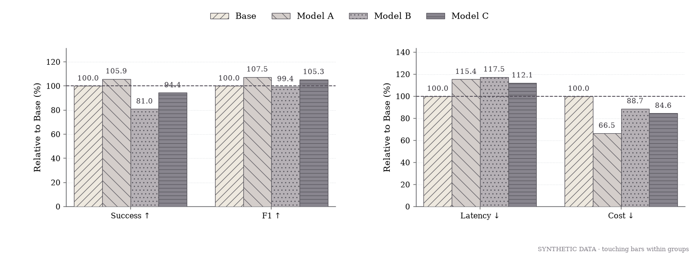</a><br><a href="skills/figure/assets/examples/hatched_bar_normalized_metrics.png">PNG</a> · <a href="skills/figure/assets/examples/hatched_bar_normalized_metrics.pdf">PDF</a> · <a href="skills/figure/assets/examples/hatched_bar_normalized_metrics.svg">SVG</a></td>
    <td align="center" width="33%"><b>全连续纹理柱群</b><br><a href="skills/figure/assets/examples/hatched_bar_continuous_blocks.png">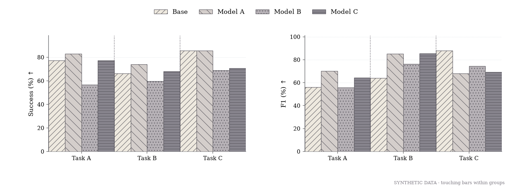</a><br><a href="skills/figure/assets/examples/hatched_bar_continuous_blocks.png">PNG</a> · <a href="skills/figure/assets/examples/hatched_bar_continuous_blocks.pdf">PDF</a> · <a href="skills/figure/assets/examples/hatched_bar_continuous_blocks.svg">SVG</a></td>
  </tr>
</table>

[设计规则](skills/figure/references/hatched-bars.md) · [绘图代码](skills/figure/scripts/render_hatched_bars.py) · [数据 JSON](skills/figure/assets/examples/hatched_bar_data.json) · [CSV](skills/figure/assets/examples/hatched_bar_data.csv)

### 透视归一化三维柱状图

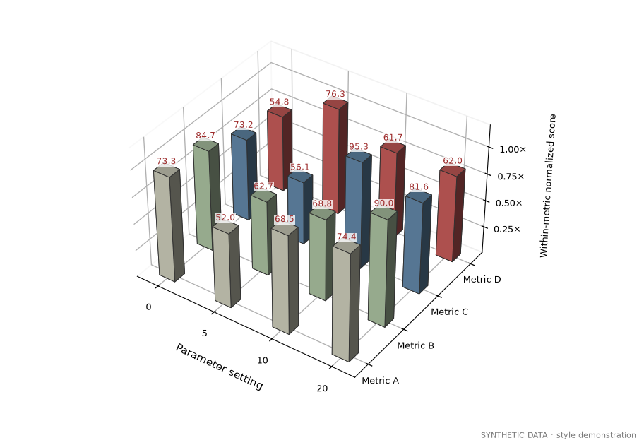

[高清 PNG](skills/figure/assets/examples/perspective_normalized_3d_bars_synthetic.png) · [PDF](skills/figure/assets/examples/perspective_normalized_3d_bars_synthetic.pdf) · [SVG](skills/figure/assets/examples/perspective_normalized_3d_bars_synthetic.svg)

### 分层半透明三维训练曲线

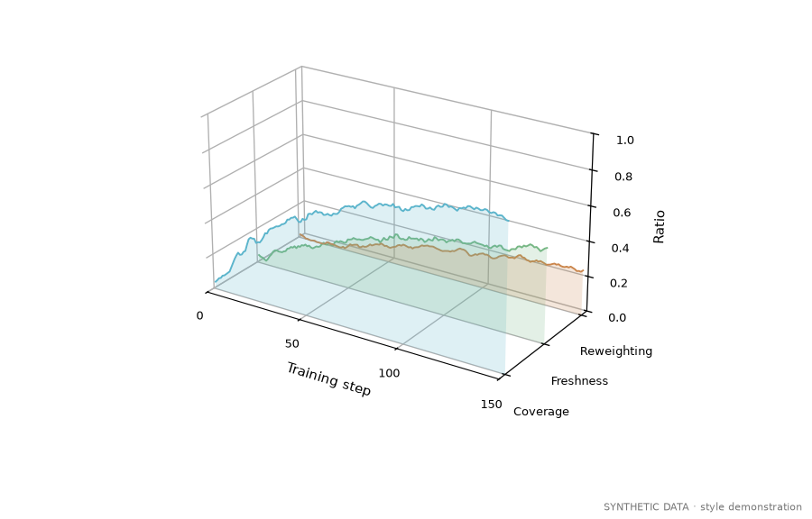

[高清 PNG](skills/figure/assets/examples/perspective_3d_ribbon_dynamics_synthetic.png) · [PDF](skills/figure/assets/examples/perspective_3d_ribbon_dynamics_synthetic.pdf) · [SVG](skills/figure/assets/examples/perspective_3d_ribbon_dynamics_synthetic.svg)

[Figure skill](skills/figure/SKILL.md) · [风格说明](skills/figure/references/styles.md) · [绘图代码](skills/figure/scripts/render_examples.py) · [模拟数据 JSON](skills/figure/assets/examples/synthetic_data.json) · [CSV 数据](skills/figure/assets/examples/data)

调用示例：

> 使用 /path/to/draw-skills-motivation_method/skills/figure/SKILL.md，根据参考图与我提供的数据绘制论文实验图，保留配色、布局和标记风格，导出 PNG、PDF、SVG，并保存数据与代码。

需要模拟数据时明确说明允许模拟；图中保留 `SYNTHETIC DATA` 标注。用 Python、NumPy 和 Matplotlib 重放本仓库示例：

```bash
python skills/figure/scripts/render_examples.py --out ./figure-output \
  --data skills/figure/assets/examples/synthetic_data.json
```

雷达图、纹理双面板柱状图及两种三维图使用 [几何风格脚本](skills/figure/scripts/render_geometric_styles.py) 与 [配套模拟数据](skills/figure/assets/examples/geometric_styles_data.json)：

```bash
python skills/figure/scripts/render_geometric_styles.py --out ./geometric-figures \
  --data skills/figure/assets/examples/geometric_styles_data.json
```

六张彩色外环雷达图使用相同数据、轴顺序和 0–100 刻度，只改变彩环、网格、文字与线条设计。

[六种雷达图对照总览](skills/figure/assets/examples/radar_gallery_overview.png) · [雷达图设计说明](skills/figure/references/radar-design.md) · [雷达数据](skills/figure/assets/examples/radar_data.json) · [绘图代码](skills/figure/scripts/render_radar_gallery.py)

```bash
python skills/figure/scripts/render_radar_gallery.py --out ./radar-gallery \
  --data skills/figure/assets/examples/radar_data.json
```

## Excalidraw 运行与导出

需要 Node.js 18+、Chromium；新建 skeleton 时还需 Python 3。每套 skill 自带依赖清单及真实 Excalidraw 导出脚本。详细操作见 [渲染指南](skills/method/references/rendering.md)。

```bash
npm install --prefix skills/method/scripts/runtime
cd skills/method/scripts/runtime
npx playwright install chromium
```

在仓库根目录导出现有图：

```bash
node skills/method/scripts/export_scene.mjs \
  --input /path/to/figure.excalidraw \
  --out-prefix /path/to/output/figure
```

PNG 默认 3 倍像素尺寸并写入 300 dpi 元数据；PDF 为按画布尺寸生成的单页文件。复杂公式优先通过 LaTeX Live 渲染，保留 `.tex`；公式图片可移动缩放，字符修改后需重新渲染。

## 素材与授权

OpenMoji 素材保留 CC BY-SA 4.0 许可及来源记录。部分 Flaticon 素材的作者和具体出版/再分发许可尚未核实；本仓库不对第三方素材授予额外许可，正式发表或再分发须核实并按许可署名。详见各 skill 的素材说明与 `assets/icons`。
